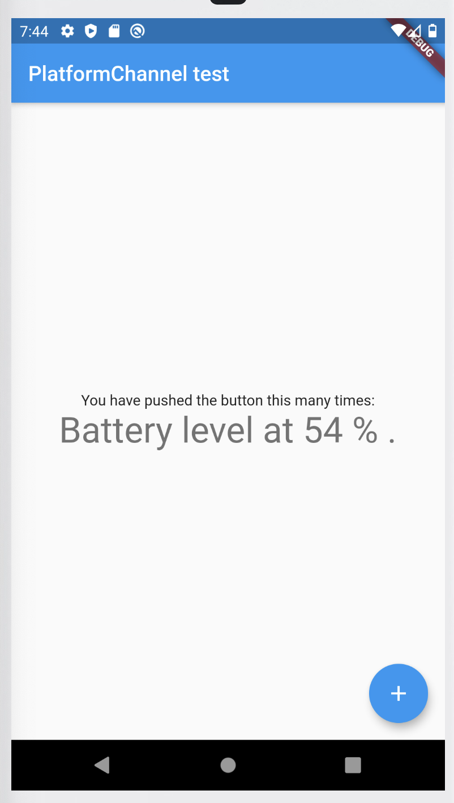
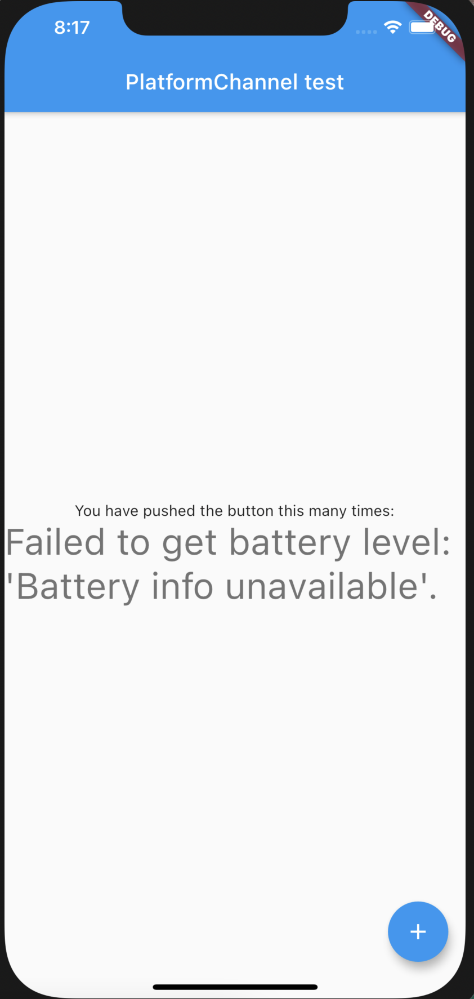

# PlatformChannel
Learning how to call native methods
 
# If using the iOS Simulator, note that it does not support battery APIs, and the app displays ‘battery info unavailable’.
 
Android 

 
 

Android 

